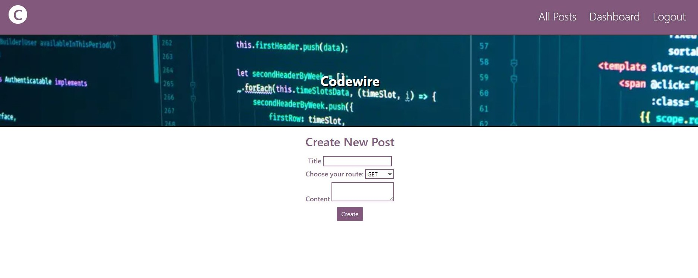

# Codewire

A place to connect developers and share code snippets.

## Description

Codewire is a Code Repository in the form of a community blog. This app allows users to post, comment on and rate reusable snippets of code.

We were motivated by how many Routes and Models we’ve had to make that were exactly or almost identical to one we’ve already written. We realized how much time an online repository for these snippets would save.

As a Programmer, I Want a community driven repository for code to save time and effort.

## Built With

* HTML
* CSS
* Javascript
* Express
* MySQL
* Handlebars
* Node

## [Website](https://codewireapp.herokuapp.com/)

## Authors

* [Garret Hobson](https://github.com/GartTheSkeleton)
* [Matthew Parker](https://github.com/mattparker124)
* [Nathaniel Hernandez](https://github.com/thetryworks)
* [Davon Brown](https://github.com/DavonHB)

## License

MIT License

Copyright (c) [2022] [Nathaniel Hernandez][Garret Hobson][Matthew Parker]

Permission is hereby granted, free of charge, to any person obtaining a copy
of this software and associated documentation files (the "Software"), to deal
in the Software without restriction, including without limitation the rights
to use, copy, modify, merge, publish, distribute, sublicense, and/or sell
copies of the Software, and to permit persons to whom the Software is
furnished to do so, subject to the following conditions:

The above copyright notice and this permission notice shall be included in all
copies or substantial portions of the Software.

THE SOFTWARE IS PROVIDED "AS IS", WITHOUT WARRANTY OF ANY KIND, EXPRESS OR
IMPLIED, INCLUDING BUT NOT LIMITED TO THE WARRANTIES OF MERCHANTABILITY,
FITNESS FOR A PARTICULAR PURPOSE AND NONINFRINGEMENT. IN NO EVENT SHALL THE
AUTHORS OR COPYRIGHT HOLDERS BE LIABLE FOR ANY CLAIM, DAMAGES OR OTHER
LIABILITY, WHETHER IN AN ACTION OF CONTRACT, TORT OR OTHERWISE, ARISING FROM,
OUT OF OR IN CONNECTION WITH THE SOFTWARE OR THE USE OR OTHER DEALINGS IN THE
SOFTWARE.

